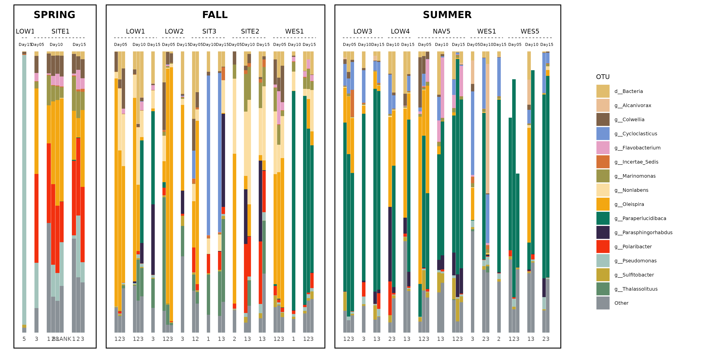

# plotutilityscript

Utility plotting functions for microbiome, groundwater, and ecological community datasets.

---

## Features

Currently includes:

- `nested_abundance_plot()`
  - Creates nested abundance bar plots from long-format data.
  - Supports arbitrary nested facet levels using ggh4x.
  - Automatically separates higher-level groups, such as Season, into bordered panels.
  - Uses a shared y-axis and shared legend.
  - Combines panels using patchwork.
  - Supports custom fill palettes and ggplot2 fill scales.
  - Supports proportional panel widths when split groups have different numbers of bars.
  - Supports user-defined ggplot2 theme modifications.
  - Allows control of strip text size, bar width, x-axis padding, y-axis padding, and split-panel spacing.

<p align="center">
  
</p>

---

## Installation

### Install directly from GitHub

Install the required package:

```r
install.packages("remotes")
```

Install plotutilityscript:

```r
remotes::install_github(
  "gamalielcabria/plotutilityscript"
)
```

Load the package:

```r
library(plotutilityscript)
```

---

### Install from a local clone

Clone the repository:

```bash
git clone https://github.com/gamalielcabria/plotutilityscript.git
```

Install from source:

```r
install.packages(
  "~/path/to/plotutilityscript",
  repos = NULL,
  type = "source"
)
```

Load the package:

```r
library(plotutilityscript)
```

---

## Dependencies

The package automatically installs required dependencies:

- ggplot2
- dplyr
- purrr
- rlang
- ggh4x
- patchwork
- cowplot
- grid

---

## Input Data Requirements

The input data should be in long format, with one row per observation.

Example:

| Season | Site.ID | Timepoint | Replicate | Genus | Abundance |
|----------|----------|----------|----------|----------|----------|
| Spring | Site_A | W1 | R1 | Genus_A | 0.25 |
| Spring | Site_A | W1 | R1 | Genus_B | 0.12 |
| Spring | Site_A | W1 | R1 | Genus_C | 0.08 |

The function requires columns for:

- x-axis values, such as replicate or duplicate sample ID
- y-axis values, such as relative abundance
- fill grouping, such as OTU, Genus, or Phylum
- split grouping, such as Season
- nested facet variables, such as Site.ID and Timepoint

---

## Basic Example

This is the simplest use case. It uses the default style and splits the plot by `Season`.

```r
library(plotutilityscript)

p <- nested_abundance_plot(
  data = plot_df,
  x_col = Duplicate,
  y_col = RelAbund,
  fill_col = Phylum,
  split_col = Season,
  nested_cols = c("Location", "Week")
)

p
```

---

## More Customized Example

This example uses more of the available customization options.

```r
library(plotutilityscript)

p <- nested_abundance_plot(
  # Data and required mappings
  data = plot_df,
  x_col = Replicate,      # x-axis categories; here, replicate samples
  y_col = Abundance,      # bar height; here, relative abundance
  fill_col = Genus,       # stacked bar fill groups
  split_col = Season,     # creates one bordered plot block per season
  nested_cols = c("Site.ID", "Timepoint"), # nested facet strips within season

  # Color Palette
  palette = wes16,

  # Axis and legend labels
  y_label = "Relative abundance",
  fill_label = "OTU",

  # Y-axis scale
  y_limits = c(0, 1),              # fixed y-axis range
  y_breaks = seq(0, 1, 0.2),       # y-axis tick marks
  show_y_axis = FALSE,

  # Split-panel layout
  split_width_mode = "proportional", # season widths follow number of bars
  min_split_width = 1,               # minimum relative width per season
  season_gap = 0.02,                 # space between season plot blocks
  layout_widths = c(0.04, 1, 0.25),  # y-axis, main plot, legend widths

  # Bar and panel spacing
  x_expand = c(0.05, 0),       # fallback x-axis expansion
  x_padding = c(0, 1),         # left/right padding inside facets
  y_padding = c(0, 0),         # bottom/top y-axis padding
  plot_margin = ggplot2::margin(8, 12, 8, 8), # space inside season border

  # Strip text styling
  strip_text_size = c(12, 8, 6), # strip text sizes for nested levels
  strip_text_face = c("bold", "plain", "plain"), # For both size and face, the order starts from highest level to the smallest levels

  # Extra ggplot theme modifications
  plot_theme = ggplot2::theme(
    axis.text.x = ggplot2::element_text(
      angle = 0,
      hjust = 0.5,
      size = 7
    ),
    legend.text = ggplot2::element_text(size = 6),
    legend.title = ggplot2::element_text(size = 8)
  )
)

p

ggsave("plot.png", plot = p, width = 12, height = 6, dpi = 300, units = "in")
```

### What this customized example does

- `x_col = Replicate` places replicate IDs on the x-axis.
- `y_col = Abundance` uses abundance values as the bar heights.
- `fill_col = Genus` stacks bars by genus.
- `split_col = Season` creates one bordered plot block per season.
- `nested_cols = c("Site.ID", "Timepoint")` creates nested facet strips within each season.
- `split_width_mode = "proportional"` makes season panels wider when they contain more bars.
- `min_split_width = 1` sets the minimum relative width for smaller season panels.
- `x_padding = c(0.5, 1)` adds horizontal breathing room inside each facet.
- `y_padding = c(0, 0)` keeps the y-axis tightly aligned from 0 to 1.
- `strip_text_size = c(12, 8, 6)` controls nested strip text sizes.
- `plot_margin = ggplot2::margin(8, 12, 8, 8)` adds space between the outer season border and plot contents.
- `layout_widths = c(0.04, 1, 0.25)` controls the relative widths of the y-axis, main plot, and legend.
- `plot_theme` applies additional ggplot2 theme changes, such as rotated x-axis text and smaller legend text.


Here is an example of the code above:


---

## Function Reference

### nested_abundance_plot()

Create a nested abundance bar plot with:

- Shared y-axis
- Shared legend
- Dynamic split panels
- Nested facet strips
- Automatic patchwork layout
- Optional proportional split-panel widths
- Optional palette and fill-scale customization
- Optional theme customization

#### Required arguments

```r
nested_abundance_plot(
  data,
  x_col,
  y_col,
  fill_col,
  split_col,
  nested_cols
)
```

#### Common optional arguments

```r
nested_abundance_plot(
  data = plot_df,
  x_col = Replicate,
  y_col = Abundance,
  fill_col = Genus,
  split_col = Season,
  nested_cols = c("Site.ID", "Timepoint"),

  y_label = "Relative abundance",
  fill_label = "Genus",

  split_width_mode = "proportional",
  min_split_width = 1,

  bar_width = 0.95,
  x_padding = c(0.5, 1),
  y_padding = c(0, 0.03),

  strip_text_size = c(12, 8),
  strip_text_face = c("bold", "plain"),

  plot_margin = ggplot2::margin(8, 12, 8, 8),

  plot_theme = ggplot2::theme(
    axis.text.x = ggplot2::element_text(angle = 45, hjust = 1)
  )
)
```

---

## Colour Customization

### Named palette

```r
my_palette <- c(
  Bacillota = "#f38400",
  Bacteroidota = "#be0032",
  Pseudomonadota = "#0067a5"
)

p <- nested_abundance_plot(
  data = plot_df,
  x_col = Duplicate,
  y_col = RelAbund,
  fill_col = Phylum,
  split_col = Season,
  nested_cols = c("Location", "Week"),
  palette = my_palette
)
```

### ggplot2 fill scale

```r
p <- nested_abundance_plot(
  data = plot_df,
  x_col = Duplicate,
  y_col = RelAbund,
  fill_col = Phylum,
  split_col = Season,
  nested_cols = c("Location", "Week"),
  fill_scale = ggplot2::scale_fill_brewer(palette = "Set3")
)
```

If both `palette` and `fill_scale` are supplied, `fill_scale` is used.

---

## Theme Customization

Use `plot_theme` to modify ggplot2 theme elements.

```r
p <- nested_abundance_plot(
  data = plot_df,
  x_col = Duplicate,
  y_col = RelAbund,
  fill_col = Phylum,
  split_col = Season,
  nested_cols = c("Location", "Week"),
  plot_theme = ggplot2::theme(
    axis.text.x = ggplot2::element_text(angle = 45, hjust = 1),
    legend.text = ggplot2::element_text(size = 7),
    legend.title = ggplot2::element_text(size = 9)
  )
)
```

---

## Saving a Plot

```r
ggplot2::ggsave(
  filename = "nested_abundance_plot.png",
  plot = p,
  width = 12,
  height = 6,
  dpi = 300,
  units = "in"
)
```

If proportional panel widths are used and some groups contain many more bars than others, increase the output width.

---

## Development

Clone the repository:

```bash
git clone https://github.com/gamalielcabria/plotutilityscript.git
cd plotutilityscript
```

Install development tools:

```r
install.packages(
  c(
    "devtools",
    "roxygen2",
    "usethis"
  )
)
```

Generate documentation:

```r
devtools::document()
```

Run package checks:

```r
devtools::check()
```

Install the development version:

```r
devtools::install()
```

---

## License

MIT License

Copyright (c) Gamaliel Cabria