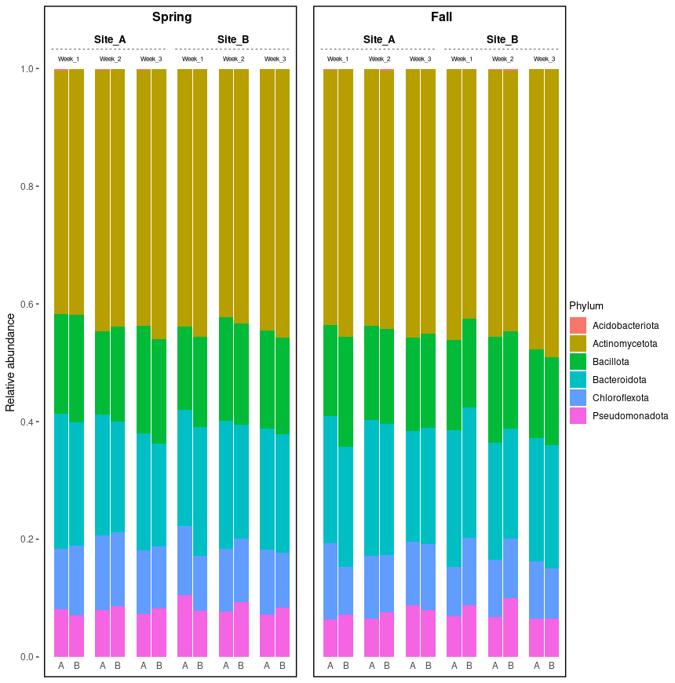

# plotutilityscript

Utility plotting functions for microbiome, groundwater, and ecological community datasets.

---

## Features

Currently includes:

- `nested_abundance_plot()`
  - Creates nested abundance bar plots from long-format data.
  - Supports arbitrary nested facet levels using ggh4x.
  - Automatically separates higher-level groups (e.g. Season) into bordered panels.
  - Uses a shared y-axis and shared legend.
  - Combines panels using patchwork.

---

## Installation

### Install directly from GitHub

Install the required package:

```r
install.packages("remotes")
```

Install plotutilityscript:

```r
remotes::install_github(
  "gamalielcabria/plotutilityscript"
)
```

Load the package:

```r
library(plotutilityscript)
```

---

### Install from a local clone

Clone the repository:

```bash
git clone https://github.com/gamalielcabria/plotutilityscript.git
```

Install from source:

```r
install.packages(
  "~/path/to/plotutilityscript",
  repos = NULL,
  type = "source"
)
```

Load the package:

```r
library(plotutilityscript)
```

---

## Dependencies

The package automatically installs required dependencies:

- ggplot2
- dplyr
- purrr
- rlang
- ggh4x
- patchwork
- cowplot

---

## Input Data Requirements

The input data should be in long format, with one row per observation.

Example:

| Season | Location | Week | Duplicate | Phylum | RelAbund |
|----------|----------|----------|----------|----------|----------|
| Spring | Site_A | Week_1 | A | Bacillota | 0.25 |
| Spring | Site_A | Week_1 | A | Bacteroidota | 0.12 |
| Spring | Site_A | Week_1 | A | Pseudomonadota | 0.08 |

---

## Basic Example

```r
library(plotutilityscript)

p <- nested_abundance_plot(
  data = plot_df,
  x_col = Duplicate,
  y_col = RelAbund,
  fill_col = Phylum,
  split_col = Season,
  nested_cols = c("Location", "Week")
)

p
```

---

## Example Output



---

## Function Reference

### nested_abundance_plot()

Create a nested abundance bar plot with:

- Shared y-axis
- Shared legend
- Dynamic split panels
- Nested facet strips
- Automatic patchwork layout

#### Required arguments

```r
nested_abundance_plot(
  data,
  x_col,
  y_col,
  fill_col,
  split_col,
  nested_cols
)
```

#### Example

```r
nested_abundance_plot(
  data = plot_df,
  x_col = Duplicate,
  y_col = RelAbund,
  fill_col = Phylum,
  split_col = Season,
  nested_cols = c("Location", "Week")
)
```

---

## Development

Clone the repository:

```bash
git clone https://github.com/gamalielcabria/plotutilityscript.git
cd plotutilityscript
```

Install development tools:

```r
install.packages(
  c(
    "devtools",
    "roxygen2",
    "usethis"
  )
)
```

Generate documentation:

```r
devtools::document()
```

Run package checks:

```r
devtools::check()
```

Install the development version:

```r
devtools::install()
```

---

## License

MIT License

Copyright (c) Gamaliel Cabria